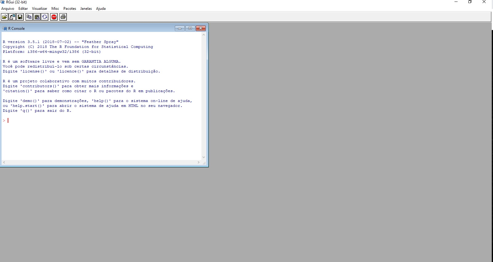
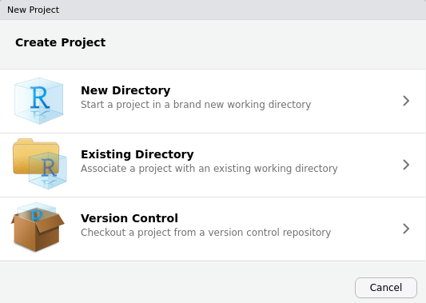

```{r setup, include=FALSE}
knitr::opts_chunk$set(echo = FALSE)

```

# Preliminares
<p style="text-align: justify;">
O software R é um conjunto integrado de recursos para leitura e manipulação de dados, cálculos e exibição gráfica. O R é um programa baseado em linhas de comando. Isto é, o usuário cria uma linha de código através de uma sequência de palavras e números. Ao digitar a linha no console, o R interpreta e executa a ação codificada na linha. Também é possível informar para R, um conjunto de linhas de
uma única vez, que conhecemos como script. Ao processar o script no console, o R irá ler a primeira linha, interpretar e executar. Só depois que o processamento da primeira linha terminar, é que a segunda linha será lida, interpretada e executada. Esta sequência segue, até que todo o script tenha sido processado. 
</p>
 
<p style="text-align: justify;">
No caso do R, a linguagem utilizada recebe o mesmo nome: linguagem R. A linguagem R possui regras próprias, que chamamos de sintaxe. Estas regras precisam ser seguidas para assegurar que o programa interprete e processe as linhas com sucesso.
</p>

#

Após instalar o software R e abrir o programa veremos algo semelhante a:

```{r, out.width = "1000px", fig.align='center'}

```

#

<p style="text-align: justify;">
Apesar de ser simples utilizar o R diretamente do seu console raiz, existe um compilador que é mais atrativo. O RStudio é o melhor ambiente disponível para programação em R. Ao abrir o RStudio, você verá 4 ambientes. Observe a figura abaixo.
</p>
```{r, out.width = "700px", fig.align='center'}
knitr::include_graphics("Figuras/rstudio-editor.png")
```
<p style="text-align: justify;">
Esses quadrantes representam o **editor**, o **console**, o **environment** e o **output**.  Eles vêm nesta ordem, e depois você pode organizá-los da forma que preferir.
</p>
#
Listamos abaixo as funções dos principais painéis:

- **Editor/Scripts**: é onde escrevemos nossos códigos.
- **Console**: é onde rodamos o código e recebemos as saídas. O R vive aqui!
- **Environment**: painel com todos os objetos criados na sessão.
- **Files**: mostra os arquivos no diretório de trabalho. É possível navegar entre diretórios.
- **Plots**: painel onde os gráficos serão apresentados.
- **Help**: janela onde a documentação das funções serão apresentadas.
- **History**: painel com um histórico dos comandos rodados.

#

Conhecer atalhos ajuda bastante quando estamos programando no RStudio. Veja os principais:

- **CTRL+ENTER**: roda a linha selecionada no script. Os atalhos mais utilizado.
- **ALT+-**: (<-) sinal de atribuição. Você usará o tempo todo.
- **CTRL+SHIFT+M**: (%>%) operador *pipe*. Guarde esse atalho, você usará bastante.
- **CTRL+1**: altera cursor para o script.
- **CTRL+2**: altera cursor para o console.
- **CTRL+ALT+I**: cria um chunk no R Markdown.
- **ALT+SHIFT+K**: janela com todos os atalhos disponíveis.

#

Vamos agora começar a trabalhar!

```{r, out.width = "900px", fig.align='center'}
knitr::include_graphics("Figuras/beginWork.gif")
```

#

<p style="text-align: justify;">
Na linguagem R, não é necessário declarar uma variável antes dela ser criada. O programa já tenta determinar a melhor classe com base na primeira vez que algo for atribuído à variável. Vamos rodar a seguinte linha: 
</p>

```{r, echo=TRUE}
x = 1
```


O sinal "=" é a representação do termo atribuição, e pode ser substituído pelo sinal "<-". Portanto, o comando abaixo equivale ao comando anterior:

```{r,echo=TRUE}
x <- 1
```

#

<p style="text-align: justify;">
Os comandos acima são equivalentes e podem ser interpretados como: atribua o valor $1$ à variável `x`. Ao criar a variável `x`, o R irá definir `x` como numérico e armazenar numa estrutura de vetor, pois o $1$ é claramente um número. Vetor é a estrutura mais simples que uma variável pode assumir, e somente pode assumir um mesmo tipo de dados. No exemplo:
</p>
```{r,echo=TRUE}
a <- 1
```

<p style="text-align: justify;">
A variável `a` será automaticamente definida pelo R como um vetor numérico.
O principal atributo de uma estrutura do tipo vetor é o comprimento. O vetor `a`, por exemplo, é um
vetor de comprimento um, ou seja, contém apenas um elemento. Isto pode ser comprovado através
do seguinte comando:
</p>
```{r,echo=TRUE}
length(a)
```
<p style="text-align: justify;">
Note, que quando você quer criar um vetor com mais de um elemento, é necessário utilizar a função `c()`. A letra `c` vem de `components`, assim, ao utilizar a função `c()` você está informando ao R que construa um vetor com os componentes listados dentro da função.
</p>

#

<p style="text-align: justify;">
O R trabalha com padrão internacional de separação decimal e separação de colunas. A separação decimal é "." (ponto). 
E a separação de coluna é "," (vírgula).
</p>
<p style="text-align: justify;">
Matrizes nada mais são que combinações de vetores com o mesmo comprimento e tipo de dado.
As variáveis estruturadas como matriz possuem portanto uma característica que o vetor não tem:
dimensão. A dimensão é uma característica que indica quantas linhas e quantas colunas a matriz
possui. Vamos criar uma matriz e armazená-la na variável `m1`:
</p>
```{r,echo=TRUE}
m1 = matrix(c(2, 4, 3, 1, 5, 7), nrow = 2, ncol = 3, byrow = TRUE)
```
<p style="text-align: justify;">
O comando `dim()` retorna a dimensão de uma matriz. Antes de rodar esse comando para a matriz
recém criada `m1`, qual a dimensão desta matriz? Se você respondeu `2 x 3`, acertou! Agora rode o
comando abaixo e tire a prova:
</p>
```{r,echo=TRUE}
dim(m1)
```

#

<p style="text-align: justify;">
Dataframe é uma condição especial de combinação lado a lado de vetores. Ao contrário das matrizes, o dataframe não exige que os vetores tenham os mesmos tipos de dados. Assim, por exemplo, a primeira coluna do dataframe pode ser numérica, e a segunda coluna pode ser de texto e a terceira coluna com data. O R possui alguns dataframes que vem automaticamente quando o software é instalado. Estes dataframes são geralmente usados como exemplos nos tutoriais e arquivos de ajuda. Uma dessas bases é o mtcars.
</p>

Para carregarmos esta base de dados basta digitar:

```{r,echo=TRUE}
data("mtcars")
```
<p style="text-align: justify;">
Após digitar o comando acima em seu console, você terá criado uma variável na memória chamada mtcars contendo os dados em questão. 

#

Como exemplo, vamos usar o comando `head()` para visualizar as colunas deste dataframe e as 6 primeiras linhas:
</p>
```{r,echo=TRUE}
head(mtcars)
```
<p style="text-align: justify;">
Visualizando apenas as 6 primeiras linhas do dataframe mtcars podemos perceber que este é a
estrutura de dados que se assemelha às planilhas eletrônicas como Excel. Assim, podemos entender
o dataframe como sequência de observações (linhas) de determinadas variáveis (colunas).
Assim como as matrizes, os dataframes também possuem dimensão, e também podemos verificar a dimensão
através do comando dim().
</p>

#

No script abaixo, seguem outros comandos úteis para serem usados com os dataframes:

```{r,echo=TRUE}
# retorna o nome das colunas do dataframe
names(mtcars)
#retorna as 6 últimas linhas do dataframe
tail(mtcars)
```

#

```{r,echo=TRUE}
# retorna um resumo estatístico das colunas do dataframe
summary(mtcars)
```

#

<p style="text-align: justify;">
No script acima aproveitamos para apresentar a sinalização de comentário. Toda linha no R iniciada
com o `#` não é interpretada pelo console. Assim, o símbolo `#` é usado para incluirmos comentários
em nosso código. Veja que no script, cada linha iniciada pelo sinal `#` explica o comando seguinte.
</p>
Podemos acessar qualquer registro dentro do dataframe utilizando a mesma notação de matrizes:

```{r,echo=TRUE}
mtcars[1,]
mtcars[1,2]
mtcars[,3]
```

#

```{r,echo=TRUE}
mtcars[1:3,]
mtcars[,1:4]
```

#

```{r,echo=TRUE}
mtcars[1:3,1:4]
```

#

<p style="text-align: justify;">
Outro recurso poderoso do R são os filtros. Você pode tanto usar a notação de `[]` ou então a função `subset()`. Vamos ver alguns exemplos de filtros. No exemplo 1, imagine que queremos separar as linhas que possuem o valor 4 na variável `cyl`. Podemos usar a função `subset()` ou a notação `[]`:
</p>
```{r,echo=TRUE}
subset(mtcars, mtcars$cyl == 4)
```

#

```{r,echo=TRUE}
mtcars[mtcars$cyl == 4,]
```

#

Agora, imagine que queremos as variáveis `mpg` e `hp` das observações que possuem o valor 4 na variável `cyl`:

```{r,echo=TRUE}
subset(mtcars, mtcars$cyl == 4, select = c("mpg", "hp"))
mtcars[mtcars$cyl == 4, c(1, 4)]
```

#

<p style="text-align: justify;">
A última estrutura de dados que iremos ver são as listas. Listas funcionam como um varal. Num
varal podemos pendurar vários tipos de coisas. Você pode pendurar roupas, quadros, cadeira, fotos
e várias outras coisas que você nem imagina. No R, a lista funciona da mesma forma. Você pode
incluir numa lista diferentes dados e estruturas.
</p>
```{r,echo=TRUE}
a <- 1
x <- c(1,2,3)
dados <- list(1,x,mtcars)
dados
```

#

Para recuperar o objeto de uma lista, podemos usar a notação `[[ ]]`.

```{r,echo=TRUE}
dados[[2]]
```

#

<p style="text-align: justify;">
Ao longo deste capítulo, criamos na memória do nosso computador várias variáveis. Você consegue
se lembrar de todas elas? Não se preocupe. Existe uma função que faz isto para você:
</p>
```{r,echo=TRUE}
ls()
```

E se não quisermos mais a variável `x`? Sem problemas, podemos deletar através do comando `rm()`:
```{r,echo=TRUE}
rm(x)
```

Se quiser excluir todas as variáveis que você criou na memória, basta usar o comando:
```{r,echo=TRUE}
rm(list = ls(all=TRUE))
```

#

### Objetos atômicos

Existem cinco classes básicas ou “atômicas” no R:

- character 
- numeric 
- integer 
- complex 
- logical 

#

Veja alguns exemplos:

```{r,echo=TRUE}
# characters

"a"
"1"
"positivo"
"Error: objeto x não encontrado"

# numeric

1
0.10
0.95
pi

# integer

1L
5L
10L

# complex (raramente utilizado para análise de dados)

2 + 5i

# logical

TRUE
FALSE
```

#

Para saber a classe de um objetivo, você pode usar a função `class()`.

```{r,echo=TRUE}
x <- 1
class(x)

y <- "a"
class(y)

z <- TRUE
class(z)
```

#

### Vetores

Vetores no R são os objetos mais simples que podem guardar objetos atômicos.

```{r,echo=TRUE}
vetor1 <- c(1, 2, 3, 4)
vetor2 <- c("a", "b", "c")

vetor1
vetor2
```

#

Um vetor tem sempre a mesma classe dos objetos que guarda.

```{r,echo=TRUE}
class(vetor1)
class(vetor2)
```

#

De forma bastante intuitiva, você pode fazer operações com vetores.

```{r,echo=TRUE}
vetor1 - 1
```

Quando você faz `vetor1 - 1`, o R subtrai `1` de cada um dos elementos do vetor. O mesmo acontece quando você faz qualquer operação aritmética com vetores no R.

```{r, eval=FALSE}
vetor1 / 2
vetor1 * 10
```

Você também pode fazer operações que envolvem mais de um vetor:

```{r,echo=TRUE}
vetor1 * vetor1
```

#

<p style="text-align: justify;">
Neste caso, o R irá alinhar os dois vetores e multiplicar elemento por elemento. Isso pode ficar um pouco confuso quando os dois vetores não possuem o mesmo tamanho:
</p>
```{r,echo=TRUE}
vetor2 <- 1:3
vetor1 * vetor2
```
<p style="text-align: justify;">
O R alinhou os dois vetores e, como eles não possuíam o mesmo tamanho, foi repetindo o vetor menor até completar o vetor maior. Esse comportamento é chamado de **reciclagem** e é útil para fazer operações elemento por elemento (vetorizadamente), mas às vezes pode ser confuso. Com o tempo, você aprenderá a se aproveitar dele.
</p>

#

### Misturando objetos

<div class='admonition note'>
<p class='admonition-title'>
Vetores são homogêneos
</p>
<p style="text-align: justify;">
Os elementos de um vetor são sempre da mesma classe. Ou todos são numéricos, ou são todos character, ou todos são lógicos etc. Não dá para ter um número e um character no mesmo vetor, por exemplo.
</p>
</div>
<p style="text-align: justify;">
Se colocarmos duas ou mais classes diferentes dentro de um mesmo vetor, o R vai forçar que todos os elementos passem a pertencer à mesma classe. O número `1.7` viraria `"1.7"` se fosse colocado ao lado de um `"a"`.
</p>
```{r, eval=FALSE}
y <- c(1.7, "a")  ## character
y <- c(TRUE, 2)   ## numeric
y <- c(TRUE, "a") ## character
```

A ordem de precedência é:

**DOMINANTE** `character > complex > numeric > integer > logical` **RECESSIVO**

#

### Forçando classes explicitamente
<p style="text-align: justify;">
Você pode coagir um objeto a ser de uma classe específica com as funções `as.character()`, `as.numeric()`, `as.integer()` e `as.logical()`. É equivalente à função `convert()` do SQL. 
</p>
```{r,echo=TRUE}
x <- 0:4
class(x)
as.numeric(x)
as.logical(x)
as.character(x)
```

#

Se o R não entender como coagir uma classe na outra, ele soltará um `warning` informado que colocou `NA` no lugar.

```{r,echo=TRUE}
x <- c("a", "b", "c")
as.numeric(x)
```

<div class='admonition note'>
<p class='admonition-title'>
Observação
</p>
<p>
O <b>NA</b> tem o mesmo papel que o <b>null</b> do SQL. Porém, há um <b>NULL</b> no R também, com diferenças sutis que vamos abordar mais adiante.
</p>
</div>

#

### Fatores

Fatores podem ser vistos como vetores de inteiros que possuem rótulos (levels).

```{r,echo=TRUE}
sexo <- c("M", "H", "H", "H", "M", "M", "H")
fator <- as.factor(sexo)
fator
as.numeric(fator)
```
<p style="text-align: justify;">
Eles são úteis para representar uma variável categórica (nominal e ordinal). Na modelagem, eles serão tratados de maneira especial em funções como `lm()` e `glm()`. 
</p>

#

A função `levels()` retorna os rótulos do fator:

```{r,echo=TRUE}
levels(fator)
```

#

<p style="text-align: justify;">
Quando um vetor de números está como <b>factor</b>, ao tentar transformá-lo em <b>numeric</b>, você receberá um vetor de inteiros que não tem nada a ver com os valores originais!
</p>


```{r,echo=TRUE}
numeros <- factor(c("10", "55", "55", "12", "10", "-5", "-90"))
as.numeric(numeros)
```

Para evitar isso, use `as.character()` antes de transformar para número.

```{r,echo=TRUE}
as.numeric(as.character(numeros))
```


#

### Valores especiais

Existem valores reservados para representar dados faltantes, infinitos, e indefinições matemáticas.

- **NA** (Not Available) 
<p style="text-align: justify;">
significa dado faltante/indisponível. É o `null` do SQL ou o `.` do SAS. O `NA` tem uma classe, ou seja, podemos ter `NA` numeric, `NA` character etc.
</p>
- **NaN** (Not a Number) 

representa indefinições matemáticas, como `0/0` e `log(-1)`. Um `NaN` é um `NA`, mas a recíproca não é verdadeira.

- **Inf** (Infinito) 

é um número muito grande ou o limite matemático, por exemplo, `1/0` e `10^310`. Aceita sinal negativo `-Inf`. 

- **NULL** 
<p style="text-align: justify;">
representa a ausência de informação. Conceitualmente, a diferença entre `NA` e `NULL` é sutil, mas, no R, o `NA` está mais alinhado com os conceitos de estatística (ou como gostaríamos que os dados faltantes se comportassem em análise de dados) e o `NULL` está em sintonia com comportamentos de lógica de programação.
</p>
- Use as funções `is.na()`, `is.nan()`, `is.infinite()` e `is.null()` para testar se um objeto é um desses valores.

```{r,echo=TRUE}
x <- c(NaN, Inf, 1, 2, 3, NA)
is.na(x)
is.nan(x)
```

#

### Projetos no R
<p style="text-align: justify;">
Uma funcionalidade importante é a criação de projetos, permitindo dividir o trabalho em múltiplos ambientes, cada um com o seu diretório, documentos e workspace.
</p>
<p style="text-align: justify;">
Para criar um projeto, clique em *New Project...* no Menu File. Na caixa de diálogo que aparecerá, clique em *New Directory* para criar o projeto em uma nova pasta ou *Existing Directory* para criar em uma pasta existente. Se você tiver o Git instalado, você também pode usar projetos para conectar com repositórios do Github e outras plataformas de desenvolvimento. Para isso, basta clicar em *Version Control*.
</p>
```{r, out.width = "1000px", fig.align='center'} 

```


#

<p style="text-align: justify;">
Você conseguirá utilizar o RStudio mesmo sem definir o espaço de trabalho. No entanto, existem
alguns benefícios quando quando definimos o espaço de trabalho:
</p>
<p style="text-align: justify;">
 - Toda análise (tabelas e gráficos) quando exportada é salva automaticamente na pasta vinculada
ao espaço de trabalho.
</p>
<p style="text-align: justify;">
 - O RStudio enxerga automaticamente os arquivos existentes dentro da pasta sem a necessidade
de informar o endereço completo quando realizar uma manipulação de arquivo (ex: importar
uma planilha).
</p>
 - Tem a opção de salvar o histórico (History) e as variáveis armazenadas na memória (Environment).

# Importação de Dados

```{r, out.width = "1000px", fig.align='center'} 
knitr::include_graphics("Figuras/Programacao1.gif")
```

#

<p style="text-align: justify;">
Vamos introduzir os principais pacotes para importar dados para o R. Mostraremos como importar dados de arquivos 
de texto e de planilhas do excel. Antes é importante saber o ciclo da ciência de dados:
</p>


#

<p style="text-align: justify;">
Grande parte dos dados que utilizaremos em nossas análises estarão salvos em planilhas eletrônicas
como Excel, LibreOffice e outros. Embora seja possível importar arquivos com extensão .xls e .xlsx,
recomendo que seja utilizado sempre a extensão genérica .csv (comma-separeted value) ou . txt. Todo arquivo
do tipo csv possui dois elementos básicos que podem influenciar na importação:
</p>
 - o separador decimal
 
 - a tabulação (ou separador de colunas)
 
 #
 
<p style="text-align: justify;"> 
No formato regional brasileiro, o separador decimal é a vírgula "(,)" e o separador de coluna é o ponto
e vírgula "(;)". Já no formato americano, utiliza-se o ponto "(.)" como separador decimal e a vírgula "(,)"
como separador de colunas. Durante a importação de uma planilha eletrônica, pode ser necessário informar qual o separador
decimal e qual o separador de colunas utilizados no arquivo, para que a leitura dos dados pelo R
ocorra sem problemas.
</p>

#

Dois comandos podem ser utilizados para importar os dados:

`read.csv(arquivo, sep=..., dec=...)`

`read.table(arquivo, sep=..., dec=...)`

#

<p style="text-align: justify;">
Ambos comandos possuem os parâmetros que definem o separador de colunas e o separador decimal:
`sep` para separador de colunas e `dec` para separador decimal.
</p>
```{r,echo=TRUE}
rm(list=ls())
if(!is.null(dev.list())) dev.off()
getwd()#Visualizar diretorio de trabalho
#setwd("E:/Documentos/GitHub/MAF105/maf105.github.io/Aulas_MAF105/Curso_R")#Modificar diretorio de trabalho
cat("\014")
```

#


```{r,echo=TRUE}
#Formato .csv e .txt - Sem a necessidade de pacote
dados1 <- read.table("Dados/CompanhiaMB_clear3.csv",dec = ",")#*Lembre-se do sep = ";"
str(dados1)
dados1 <- read.table("Dados/CompanhiaMB_clear3.csv",dec = ",",sep = ";")
str(dados1)
```


```{r,echo=TRUE}
#Formato .csv e .txt - Sem a necessidade de pacote
dados1 <- read.table("Dados/CompanhiaMB_clear3.csv",dec = ",",sep = ";",header = TRUE)
str(dados1)
dados2 <- read.table("Dados/CompanhiaMB_clear.txt",dec = ",",sep = ";",encoding="UTF-8")
str(dados2)
```


```{r,echo=TRUE}
#Formato .csv e .txt - Sem a necessidade de pacote
dados2 <- read.table("Dados/CompanhiaMB_clear.txt", encoding="UTF-8", sep="")
str(dados2)
dados2 <- read.table("Dados/CompanhiaMB_clear.txt", encoding="UTF-8", sep="",header = TRUE,dec = ",")
str(dados2)
names(dados2) <- c("Registro","Estado_Civil","Grau","N_filhos","Salario","Id_Anos","Id_Meses","Procedencia")
head(dados2)
```

#

Outras Funções

```{r,echo=TRUE}
#Formato .csv e .txt - Sem a necessidade de pacote
dados1 <- read.csv("Dados/CompanhiaMB_clear3.csv",dec = ",")#*Lembre-se do sep = ";"
str(dados1)
dados1 <- read.csv("Dados/CompanhiaMB_clear3.csv",dec = ",",sep = ";")
str(dados1)
dados2 <- read.csv("Dados/CompanhiaMB_clear.txt",dec = ",",sep = ";",encoding="UTF-8")
str(dados2)
dados2 <- read.csv2("Dados/CompanhiaMB_clear.txt", encoding="UTF-8", sep="")
str(dados2)
names(dados2) <- c("Registro","Estado_Civil","Grau","N_filhos","Salario","Id_Anos","Id_Meses","Procedencia")
```

#

 - `read.csv()` e `read.csv2()`
<p style="text-align: justify;"> 
As funções `read.csv()` e `read.csv2()` são freqüentemente usadas para salvar conjuntos de dados no Excel `.csv` ou em Valores Separados por Vírgula. `read.csv()` e `read.csv2()`temos diferentes símbolos separadores: para o primeiro, é uma vírgula, enquanto o segundo usa um ponto e vírgula. Tudo se resolve ao usar `sep=";"` quando necessário.
</p>

#

 - Usando pacotes

```{r,echo=TRUE}
#Pacote para a leitura de .xlsx e .xls
library(readxl)
dados3<- read_excel("Dados/CompanhiaMB_clear.xlsx")
str(dados3)
dados4 <- read_excel("Dados/CompanhiaMB_clear2.xls",col_types = c("numeric", "text", "text","text", "numeric", "numeric", "numeric","text"))
str(dados4)
#Pacote para a leitura de .txt e .csv
library(readr)
dados5 <- read_delim("Dados/CompanhiaMB_clear3.csv",";", escape_double = FALSE, trim_ws = TRUE)
str(dados5)
dados6 <- read_delim("Dados/CompanhiaMB_clear3.csv",";", escape_double = FALSE, trim_ws = TRUE,locale = locale(decimal_mark = ","))
str(dados6)
```

#

Antes de iniciar as análises com os dados importados, sempre desconfie!

```{r, out.width = "1000px", fig.align='center'} 

```

#


<p style="text-align: justify;">
Inspecione o objeto que recebeu os dados importados para garantir que não houve problemas com
o separador decimal, nem com o separador de colunas, nem com os nomes das colunas. Diversos comandos podem ser usados para
investigar os dados. Veja alguns exemplos:
</p>
 - Veja se o número de linhas e colunas correspondem à planilha eletrônica importada:

```{r,echo=TRUE}
dim(dados1)
dim(dados2)
dim(dados3)
dim(dados4)
dim(dados5)
dim(dados6)
```

#

 - Veja o formato das varáveis
 
```{r,echo=TRUE}
str(dados1)
str(dados2)
str(dados3)
str(dados4)
str(dados5)
str(dados6)
``` 

#

 - Confira se as primeiras linhas dos dados importados correspondem às primeiras linhas do
arquivo original:

```{r,echo=TRUE}
head(dados1)
head(dados2)
head(dados3)
head(dados4)
head(dados5)
head(dados6)
```

#

 - Você também pode conferir as últimas linhas dos dados importados através do comando:

```{r,echo=TRUE}
tail(dados6)
```

#

 - Veja o sumário estatísticos dos dados e veja se as colunas de números e textos foram
corretamente importados:

```{r,echo=TRUE}
summary(dados1)
summary(dados2)
summary(dados3)
summary(dados4)
summary(dados5)
summary(dados6)
```

# Help me!

```{r, out.width = "1000px", fig.align='center'} 
knitr::include_graphics("Figuras/helpMe.gif")
```

#

No R, há quatro principais entidades para se pedir ajuda:

- Help/documentação do R (comandos `help(nome_da_funcao)` ou `?nome_da_funcao`)

- Google

- Stack Overflow

- whatsapp, telegram, facebook e até no instagram!

#

A busca por ajuda é feita preferencialmente, mas não necessariamente, na ordem acima.

Você também pode pedir ajuda a um colega!!!

 
&nbsp; &nbsp; &nbsp; &nbsp; &nbsp; &nbsp; &nbsp;
--


#

### Documentação do R

A documentação do R serve para você aprender a usar uma determinada função.

```{r, eval=FALSE}
?mean
help(mean)
```

Cinco dicas:

1. Os exemplos no final são particularmente úteis.
2. Leia a seção **Usage** para ter noção de como usar.
3. Os parâmetros estão descritos em **Arguments**. Identifique quais tipos de objetos eles recebem.
4. Caso essa função não atenda às suas necessidades, a seção **See Also** sugere funções relacionadas.
5. Alguns pacotes possuem tutorias de uso mais completos. Esses textos são chamados de `vignettes` e podem ser acessados com a função `vignette(package = 'nomeDoPacote')`. Por exemplo, `vignette(package = 'dplyr')`. Depois de ver a lista de artigos, escolha um nome e rode `vignette(topic = 'nome', package = 'nomeDoPacote')`. Por exemplo, `vignette(topic = 'introduction', package = 'dplyr')`.

# Resumo de Dados
```{r, out.width = "1000px", fig.align='center'} 
knitr::include_graphics("Figuras/Programacao21.gif")
```

#


#

### Distribuições de Frequência

```{r,echo=TRUE}
url <- url("https://raw.githack.com/maf105/maf105.github.io/master/Aulas_MAF105/Curso_R/Dados/CompanhiaMB_clear3.csv")
tab2_1 <- read.table(url,dec = ",",sep = ";",header = TRUE)
ni<-table(tab2_1$Grau) # Calcula a tabela de frequências absolutas e armazena o resultado em 'mytab'
fi<-prop.table(ni) # Tabela de frequências relativas (f_i)
p_fi<-100*prop.table(ni) # Porcentagem (100 f_i)

# Adiciona linhas de total
ni<-c(ni,sum(ni)) 
fi<-c(fi,sum(fi))
p_fi<-c(p_fi,sum(p_fi))
names(ni)[4]<-"Total"
```

#

Para ter o resultado na mesma disposição que na Tabela 2.2, podemos fazer da seguinte forma:

```{r,echo=TRUE}
tab2_2<-cbind(ni,fi=round(fi,digits=2),p_fi=round(p_fi,digits=2))
tab2_2
```

#

```{r,echo=TRUE}
#quebras de linha apenas ilustrativas para facilitar a leitura
tab2_3<-as.data.frame(
        t(rbind(
            ni=c(650,1020,330,2000),
            p_fi=c(32.5,51,16.5,1)
        ))
        ,row.names =c("Fundamental","Médio","Superior","Total")
        )
tab2_3
```

#

```{r,echo=TRUE}
ni<-table(cut(tab2_1$Salario, breaks = seq(4,24,by=4),right=FALSE)) # Frequencias por categorias
tab2_4 <- rbind(ni, p_fi = 100*prop.table(ni)) # Frequencias relativas em %
#quebras de linha apenas ilustrativas para facilitar a leitura
tab2_4 <- as.data.frame(
  t(cbind(
    tab2_4,c(sum(tab2_4[1,]),sum(tab2_4[2,])) #Esta linha foi add somente para manter os nomes das colunas
             )),row.names =c(colnames(tab2_4),"Total")) #Construcao da tabela
tab2_4<-transform(tab2_4,p_fi=round(p_fi,digits=2))
tab2_4
```

#

### Ramos e Folhas

```{r,echo=TRUE}
print("Figura 2.9: Ramo-e-folhas para a Variável S: salários.")
stem(tab2_1$Salario,scale=2)
```

```{r,echo=TRUE}
#quebras de linha apenas ilustrativas para facilitar a leitura
dureza<-c(53  ,70.2,84.3,69.5,77.8,87.5,53.4,82.5,67.3,54.1,
          70.5,71.4,95.4,51.1,74.4,55.7,63.5,85.8,53.5,64.3,
          82.7,78.5,55.7,69.1,72.3,59.5,55.3,73  ,52.4,50.7
          )
print("Figura 2.10: Ramo-e-folhas para dados de dureza de peças de alumínio.")
stem(as.integer(dureza),scale=.5)
```

```{r,echo=TRUE}
print("Figura 2.11: Ramo-e-folhas para dados de dureza, com ramos divididos.")
stem(as.integer(dureza),scale=1)
```


# Representação Gráfica


#

### Gráfico de barras

```{r,echo=TRUE,fig.align="Center"}
#quebras de linha apenas ilustrativas para facilitar a leitura
barplot(
  table(tab2_1$Grau),
  ylab="Frequência",
  cex.names=0.7,
  names.arg = c("Fundamental","Médio", "Superior"),
  col="darkgrey",
  border=NA,
  main="Figura 2.2: Gráfico em barras para a variável Y: grau de instrução.",
  axes=TRUE,
  ylim=c(0,20)
  )
```

#

```{r,echo=TRUE,fig.align="Center"}
#quebras de linha apenas ilustrativas para facilitar a leitura
barplot(
  table(tab2_1$N_filhos),
  ylab="Frequência",
  cex.names=0.7,
  col="darkgrey",
  main="Figura 2.4: Gráfico em barras para a variável Z: Numero de filhos.",
  border=NA)
```

#

```{r,echo=TRUE,fig.align="Center"}
#quebras de linha apenas ilustrativas para facilitar a leitura
barplot(
  table(cut(tab2_1$Salario, breaks = seq(4,24,by=4),right=FALSE)),
  ylab="Frequência",
  xaxt="n",
  cex.names=0.7,
  col="darkgrey",
  border=NA,
  main="Figura 2.6: Gráfico em barras para a variável S: salários")
axis(1,at=c(.75,1.9,3.1,4.3,5.5),labels=seq(6,22,4),tick=F)
```

#

### Gráfico de setores (pizza)

```{r,echo=TRUE,fig.align="Center"}
labs<-paste(1:3,"(",tab2_2[1:3,1],";",round(tab2_2[1:3,3],1),"%)",sep="")
pie(table(tab2_1$Grau),labels=labs)
#title("Figura 2.3: Gráfico em setores para a variável Y: grau de instrução")
legend(-1.1,-0.8,legend=c("1=Fundamental, 2=Médio, 3=Superior"),border=NA,box.col=NA)
```

#

### Histograma

```{r,echo=TRUE}
fig27<-hist(tab2_1$Salario, breaks = seq(4,24,by=4),right=FALSE,probability = T,plot=F)
aux<-with(fig27, 100 * density* diff(breaks)[1])
labs <- paste(round(aux), "%", sep="")
#quebras de linha apenas ilustrativas para facilitar a leitura
plot(fig27, 
     freq = FALSE, labels = labs, 
     ylab="Densidade de Frequência",
     xlab="Salário",
     col="darkgrey",
     border="white",
     #labels=T,
     main="Figura 2.7: Histograma da variável S: salários",
     xlim=c(0,24), xaxp=c(0,24,6),
     ylim=c(0,.1))
```

#

```{r,echo=TRUE}
fig28<-hist(tab2_1$N_filhos, right=F, breaks=seq(-.5,5.5,1),plot=F)
aux<-with(fig28, 100 * density* diff(breaks)[1])
labs <- paste(round(aux), "%", sep="")
#quebras de linha apenas ilustrativas para facilitar a leitura
plot(fig28,
  ylab="Densidade de Frequência",
  xlab="Número de Filhos",
  col="darkgrey",
  border="white",
  bty="n",yaxt="n",ylim=c(0,8),
  main="Figura 2.8: Histograma da variável Z: número de filhos",
  labels=labs)
```

# Referências e recomendações

[curso-r:](https://www.curso-r.com/) Descomplicando a ciência de dados. Site e blog com muito material. Os integrantes são extremamente pró-ativos.

[RPubs.](https://rpubs.com/EstatBasica/Introd) Comandos R para análises estatísticas de exercicíos e teoria do livro Estatística Básica(Bussab e Morettin, 2013) 

[Oliveira, P. F., Guerra, S., McDonnell, R.](https://cdr.ibpad.com.br/cdr-intro.pdf) **Ciência de dados com R: Introdução** – Brasília: Editora IBPAD, 2018. (Livro muito bom e gratuito) 